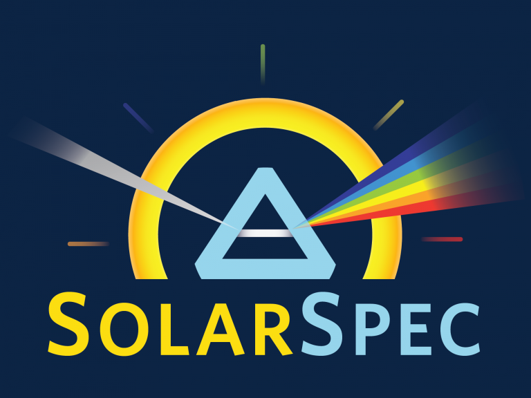

<div id="top"></div>

<!-- PROJECT SHIELDS -->
[![Contributors][contributors-shield]][contributors-url]
[![Forks][forks-shield]][forks-url]
[![Stargazers][stars-shield]][stars-url]
[![Issues][issues-shield]][issues-url]
[![MIT License][license-shield]][license-url]
[![LinkedIn][linkedin-shield]][linkedin-url]


<!-- PROJECT LOGO -->
<br />
<div align="center">
  <a href="https://github.com/SolarSpec/PIASgui">
    
  </a>

<h3 align="center">PIAS GUI</h3>

  <p align="center">
    A Graphical User Interface 
    <br />
    <a href="https://github.com/SolarSpec/PIASgui"><strong>Explore the docs »</strong></a>
    <br />
    <br />
    <a href="https://github.com/SolarSpec/PIASgui">View Demo</a>
    ·
    <a href="https://github.com/SolarSpec/PIASgui/issues">Report Bug</a>
    ·
    <a href="https://github.com/SolarSpec/PIASgui/issues">Request Feature</a>
  </p>
</div>


<!-- TABLE OF CONTENTS -->
<details>
  <summary>Table of Contents</summary>
  <ol>
    <li>
      <a href="#about-the-project">About The Project</a>
      <ul>
        <li><a href="#built-with">Built With</a></li>
      </ul>
    </li>
    <li>
      <a href="#getting-started">Getting Started</a>
      <ul>
        <li><a href="#prerequisites">Prerequisites</a></li>
        <li><a href="#installation">Installation</a></li>
      </ul>
    </li>
    <li><a href="#usage">Usage</a></li>
    <li><a href="#roadmap">Roadmap</a></li>
    <li><a href="#contributing">Contributing</a></li>
    <li><a href="#license">License</a></li>
    <li><a href="#contact">Contact</a></li>
    <li><a href="#acknowledgments">Acknowledgments</a></li>
  </ol>
</details>


<!-- ABOUT THE PROJECT -->
## About The Project

[![PIAS Screenshot][product-screenshot]](https://solarspec.ok.ubc.ca/)
A similar GUI to the Spectrabuilder application, with focus on viewing filtered and/or normalized Photoinduced Absorption Spectroscopy (PIAS)

<p align="right">(<a href="#top">back to top</a>)</p>


### Built With

* [MATLAB](https://www.mathworks.com/products/matlab.html)
* [TDMS Reader Addon](https://www.mathworks.com/matlabcentral/fileexchange/30023-tdms-reader)
* [Image Processing Toolbox](https://www.mathworks.com/help/images/)
* [Signal Processing Toolbox](https://www.mathworks.com/help/signal/)

<p align="right">(<a href="#top">back to top</a>)</p>


<!-- GETTING STARTED -->
## Getting Started

To begin using this app is very simple. Just verify you have the necessary prequisites and follow the installation instructions.

### Prerequisites

Make sure MATLAB is installed. It is available for download in the Software Distribution section under the Help tab after you log into [Canvas.](https://canvas.ubc.ca/)
Click on the "Add-Ons" dropdown menu of your MATLAB Home screen. Then click on "Manage Add-Ons" and ensure you have the Image Processing Toolbox and the Signal Processing Toolbox. If not, click on "Get Add-Ons" button instead and search for the aforementioned products.


### Installation

1. Clone the repo to your PC
   ```sh
   git clone https://github.com/SolarSpec/PIASgui.git
   ```
2. Install the application 
   ```
   Click on the .mlappinstall file in your repository to open and install in MATLAB
   ```
3. Browse the APPS header
   ```
   You will find the recently installed application and can add it to your favourites
   ```

<p align="right">(<a href="#top">back to top</a>)</p>


<!-- USAGE EXAMPLES -->
## Usage
To begin, load some PIAS (.tdms) data using the "Load TDMS" button or exported data from previous use of the GUI using the "Load CSV" button. The app will plot the optical difference or absorption percentage vs. time (s). The next and previous buttons allow you to iterate through your TDMS files and the filter switch allows you to decimate any noisy data into a clear signal. You can change the r factor of the decimation function which will in turn change the sample time; this is displayed below the "r Factor" edit field.

Additionally, the kinetics data will be normalized to a certain value determined by the selected time slice on the right panel UI Table. By default, the second time slice is selected for normalization as it usually lies at the highest point of intensity in the signal. The user has the freedom to manually input values for the center times of each slice as well as their widths. Selecting a new time slice will erase the selection of the last as there can only be one for normalization. The converted spectra data from the kinetics is also shown for each time slice. The user can also delete time slices by erasing the center times or add new ones by clicking the "Add" button above the UI table. 

The left panel table showcases each TDMS file selected and shown in the normalized plot. The checkbox selection will toggle those files on the plot. If the filter switch is turned on, then the filtered data takes precedence in the normalized plot and exported CSV data. The user can export the original and normalized kinetics as well as the spectra data in their own files. 

Finally the right panel has metadata describing the background level of the current file, as well as the wavelength and selected channel. _If a certain channel is selected for the first .tdms file and is not present in the others, then the script follows a specified heirarchy of channels to assign: ["final A-B";"A-Test  dOD"] for processed data and ["B-Test  raw"; "A-Test  raw"] for raw data._ For ease of use, the correctly specified channel is highlighted in green whereas a backup channel is highlighted in red.

<br>

### Export Example
Here is a simple example of the app used on a small dataset. The filtering is turned on and we'd like to export all the kinetics data by clicking the "Export CSV Data" button. We can view where the file was saved in the text on the left panel and can then open the CSV file to view the data.

</br>

_Please note that the bottom of each exported CSV contains an extra row of information attributed to the BackgroundLevel data of each TDMS file. This is simply a convention to carry this data if it is loaded back into the PIAS app. If one does not intend to load it back into the app, you may delete this row or store the variables somewhere else in the CSV as to not lose it for future use._

  <div class="row">
    
  </div>
  <div class="row" style="float:left">
    
  </div>


_For more information on data filtering and decimation, please refer to the [Documentation](https://www.mathworks.com/help/signal/ref/decimate.html#d123e21788)_

<p align="right">(<a href="#top">back to top</a>)</p>

<!-- ROADMAP -->
## Roadmap

- [X] Plot kinetics as Lin-Lin
    - [ ] Bring over Log-Y functionality
- [X] Select time slices for spectra
- [X] Generate normalized kinetics
- [X] Filter and decimate either/or kinetics
- [X] Select which normalized plots to view

See the [open issues](https://github.com/SolarSpec/PIASgui/issues) for a full list of proposed features (and known issues).

<p align="right">(<a href="#top">back to top</a>)</p>

<!-- CONTRIBUTING -->
## Contributing

Contributions are what make the open source community such an amazing place to learn, inspire, and create. Any contributions you make are **greatly appreciated**.

If you have a suggestion that would make this better, please fork the repo and create a pull request. You can also simply open an issue with the tag "enhancement".
Don't forget to give the project a star! Thanks again!

1. Fork the Project
2. Create your Feature Branch (`git checkout -b feature/AmazingFeature`)
3. Commit your Changes (`git commit -m 'Add some AmazingFeature'`)
4. Push to the Branch (`git push origin feature/AmazingFeature`)
5. Open a Pull Request

<p align="right">(<a href="#top">back to top</a>)</p>

<!-- LICENSE -->
## License

Distributed under the BSD 3-Clause License. See `LICENSE.txt` for more information.

<p align="right">(<a href="#top">back to top</a>)</p>

<!-- CONTACT -->
## Contact

SolarSpec - [SolarSpec Website](https://solarspec.ok.ubc.ca/) - vidihari@student.ubc.ca

Project Link: [https://github.com/SolarSpec/PIASgui](https://github.com/SolarSpec/PIASgui)

<p align="right">(<a href="#top">back to top</a>)</p>

<!-- ACKNOWLEDGMENTS -->
## Acknowledgments

* [Group Leader - Dr. Robert Godin](https://solarspec.ok.ubc.ca/people/)
* [Group Alumni - James Kivai](https://solarspec.ok.ubc.ca/people/)
* [The Entire SolarSpec Team](https://solarspec.ok.ubc.ca/people/)

<p align="right">(<a href="#top">back to top</a>)</p>

<!-- MARKDOWN LINKS & IMAGES -->
<!-- https://www.markdownguide.org/basic-syntax/#reference-style-links -->
[contributors-shield]: https://img.shields.io/github/contributors/SolarSpec/PIASgui.svg?style=for-the-badge
[contributors-url]: https://github.com/SolarSpec/PIASgui/graphs/contributors
[forks-shield]: https://img.shields.io/github/forks/SolarSpec/PIASgui.svg?style=for-the-badge
[forks-url]: https://github.com/SolarSpec/PIASgui/network/members
[stars-shield]: https://img.shields.io/github/stars/SolarSpec/PIASgui.svg?style=for-the-badge
[stars-url]: https://github.com/SolarSpec/PIASgui/stargazers
[issues-shield]: https://img.shields.io/github/issues/SolarSpec/PIASgui.svg?style=for-the-badge
[issues-url]: https://github.com/SolarSpec/PIASgui/issues
[license-shield]: https://img.shields.io/github/license/SolarSpec/PIASgui.svg?style=for-the-badge
[license-url]: https://github.com/SolarSpec/PIASgui/blob/main/LICENSE.txt
[linkedin-shield]: https://img.shields.io/badge/-LinkedIn-black.svg?style=for-the-badge&logo=linkedin&colorB=555
[linkedin-url]: https://linkedin.com/in/haris-vidimlic-06730019b/
[product-screenshot]: PIASpectra_resources/Screenshot.png
